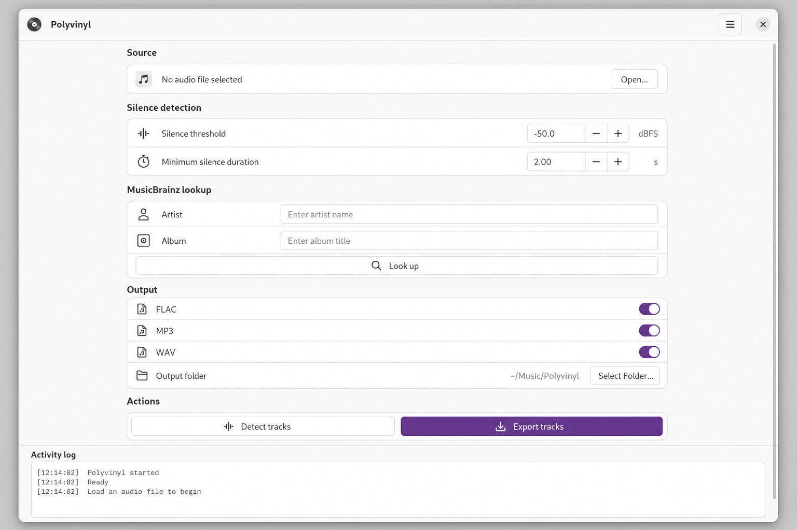

# Polyvinyl

App that **splits long vinyl WAV captures into separate tracks** using **silence detection**, looks up **track titles** via the free **[MusicBrainz](https://musicbrainz.org/)** API, and exports **FLAC**, **MP3**, and/or **16-bit WAV** with sane folder and file naming.

Two front ends share the same DSP core:

| Front end | Stack | Platform |
|---|---|---|
| **GNOME** | GTK 4 / Libadwaita · Python | Linux (Flatpak / Meson) |
| **Apple** | SwiftUI · Swift | iOS · macOS · visionOS |

**Repository:** [github.com/jwamin/polyvinyl](https://github.com/jwamin/polyvinyl)



The image above is an **illustrative preview** of the layout (Libadwaita preferences-style UI, header bar, activity log). Your installed theme may differ slightly.

## Features

- **Silence-based cueing** — configurable RMS threshold and minimum silence duration to match groove noise on your pressing, plus a **minimum gap between suggested markers** (default **30 seconds**) so short pauses inside a song do not create extra boundaries.
- **Waveform analysis** — builds a peak envelope for the whole rip, estimates noise vs programme level, and **suggests** RMS threshold and minimum silence. The drawing shows **visual feedback** for the current threshold (blue where RMS is below threshold, green where gaps meet minimum silence) and a dashed line showing the threshold relative to peak RMS level. **Refresh Markers** re-runs detection when you change the silence parameters without re-reading the file.
- **Track boundary editing** — edit **start/end** per track, **merge** with the next track, **remove** a track, **double-tap the waveform** to insert a new cut, or **single-tap anywhere** for a popover showing which tracks are before and after the tapped position with their current titles. **Preview** individual tracks via `AVAudioPlayer` (Apple) or GStreamer/ffplay (GNOME).
- **MusicBrainz lookup** — enter artist and/or album; the app fetches a track list (rate-limited to 1.1 s between requests, descriptive User-Agent, no API key required).
- **Multi-format export** — enable any combination of FLAC (lossless), MP3 (LAME VBR ~190 kbps), and PCM WAV per run.
- **Library-style paths** — `{library}/{Artist}/{Album}/{NN} - {Title}.{ext}` with filesystem-safe names.
- **Native C DSP** — RMS window series and waveform envelope are implemented in **`libpolyvinyl_dsp`** (C99, no external audio deps). On Apple platforms this is shipped as **`PolyvinylDSP.xcframework`** (macOS + iOS + visionOS slices); on Linux/GNOME it is a shared library built by Meson.

## Apple app (SwiftUI)

The `Polyvinyl/` Xcode project targets **iOS 26.5+**, **macOS 26.4+**, and **visionOS 26.5+**.

### Requirements

- Xcode 26 or later
- **ffmpeg** on `PATH` for export (install via Homebrew: `brew install ffmpeg`)
- The `PolyvinylDSP.xcframework` is pre-built and committed — no CMake step needed

### Architecture

```
Polyvinyl/
  AppModel.swift           @MainActor @Observable state + all async operations
  ContentView.swift        7-section Form: Source / Silence Detection / Waveform /
                             Tracks / MusicBrainz / Output / Activity Log;
                             drag-and-drop WAV onto window; Finder open-URL support
  WaveformView.swift       Canvas: envelope fill, blue/green silence overlays,
                             dashed threshold line, orange cut markers;
                             double-tap inserts cut, single-tap shows info popover
  TrackListView.swift      Editable title + start/end fields, merge/delete buttons;
                             stale-index guard for safe removal animation
  WavInfoSheet.swift       File metadata sheet (sample rate, channels, bit depth, duration)
  DSPBridge.swift          Swift wrapper over PolyvinylDSP C API
  SilenceDetector.swift    Swift port of silence detection algorithm
  MusicBrainzClient.swift  actor-based URLSession client (1.1 s rate limit)
  AudioExporter.swift      ffmpeg Process wrapper (macOS only)
  WavInfoReader.swift      WAV metadata via AVAudioFile
  Models.swift             TrackSpan, WavFileInfo, ExportFormat, RMSResult
  PolyvinylDSP.xcframework Static XCFramework (5 slices: macOS, iOS, iOS Sim,
                             visionOS, visionOS Sim)
```

Export uses `ffmpeg` via `Process` and is guarded by `#if os(macOS)`. Waveform analysis and MusicBrainz lookup run on all platforms.

> **Note:** The app sandbox is enabled. To write exported files to a user-chosen folder, set **User Selected File** access to **Read/Write** in the target's Signing & Capabilities.

## GNOME app (GTK 4 / Python)

### Requirements

- **Python 3**, **PyGObject**, **GTK 4**, **Libadwaita**
- **ffmpeg** on `PATH` (MP3 needs libmp3lame)
- **Preview audio:** GStreamer (play/pause/stop) or ffplay (play/stop only)

### Build & run (Meson)

```sh
meson setup build --prefix=/usr
meson compile -C build
sudo meson install -C build
polyvinyl
```

The C DSP library is built as `build/src/dsp/libpolyvinyl_dsp.so` (or `.dylib` on macOS). When running from a checkout without installing, set `POLYVINYL_DSP_LIB` to that path to enable the native backend. The backend can also be switched in **Preferences -> General** or via the `POLYVINYL_DSP_BACKEND` environment variable (`auto`, `python`, `native`).

### CMake / Make (DSP library only)

```sh
cd src/dsp
make           # builds static, shared, and (on macOS) framework
make static    # libpolyvinyl_dsp.a only
make framework # PolyvinylDSP.framework (macOS only)
```

### Flatpak

`org.jossy.gnome.polyvinyl.json` is a starter manifest. Build with `flatpak-builder` against `org.gnome.Platform`.

## Core library (Python)

`polyvinyl.core` has no GTK dependency and can be used from scripts:

```python
from polyvinyl.core import (
    rms_window_series,
    compute_waveform_envelope,
    suggest_silence_params,
    detect_track_spans,
    insert_cut,
    set_span_range,
    lookup_track_titles,
    encode_wav_segment,
    album_output_dir,
    track_filename,
)
```

`detect_track_spans(..., min_split_gap_sec=30.0, target_track_count=None)` enforces a minimum time between cuts and, when `target_track_count` is set, adjusts span count to match via `adjust_span_count_to_target`.

## License

MIT — see [COPYING](COPYING).
